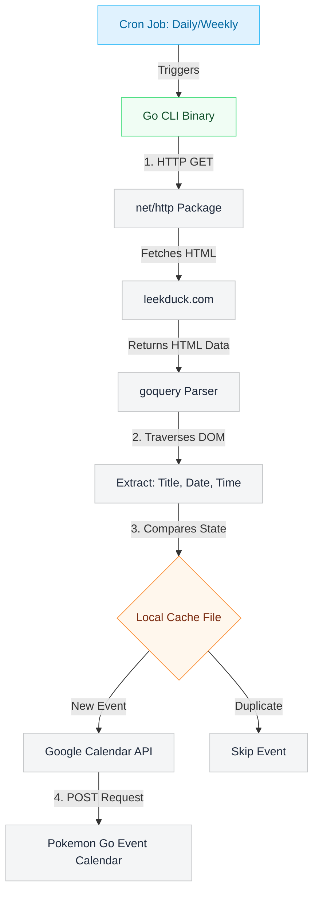

# About
A Pokemon Go CLI tool used to automatically add new game events on a Google Calendar anyone can subscribe to

# How

# Why
I wanted to learn Go in a fun way and really didn't wanna go through Tour of Go cuz it looked REALLY long and boring, so here I am. I also really love Pokemon Go so this seem liked a perfect way to learn the language!

# Incoming Additions
- Update pre-existing calendar event descriptions for more up to date data by either (1) before skipping, check if event date is within 10 days or (2) add a TTL to each json entry to update event data if found
  - Note: updates are limited to event title and description
- Add pokemon to description of event (tweak with redability)

# Future Additions
- Web-based dashboard to query all logged events to view featured pokemon, what region they're from, etc. for collection/research tasks
- Additional chrome extension to add custom banners to calendar events by:
   1. Automatically detecting the "pdqVLc" class (inner-most parent div of a gcal popup component)
   2. Proceed to get its first child which should have class "Tnsqdc "
   3. Append the class "fEQAz" to it to give it a banner
   4. Then make a child div of class "YrCd2b" and that div a child img of class "AuSgpc"
   5. Give that img component a cropped image of the leekduck event image
   6. And finally ensure the chrome extension automatically detects that parent div so that all of this is done before the user can even realize