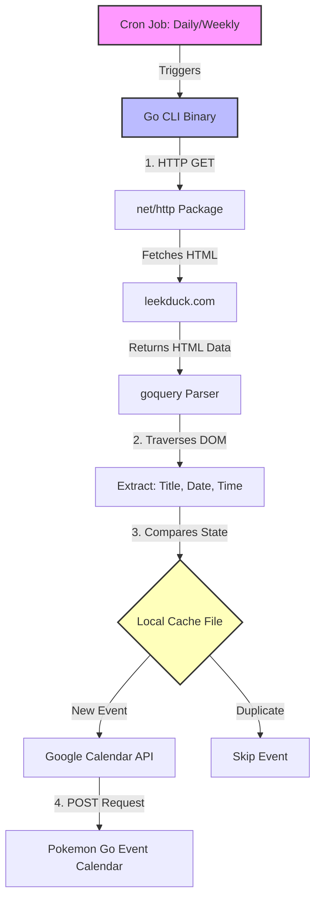

# What
A Pokemon Go CLI tool used to automatically add new game events on a Google Calendar anyone can subscribe to

# How

# Why
I wanted to learn Go in a fun way and really didn't wanna go through Tour of Go cuz it looked REALLY long and boring, so here I am. I also really love Pokemon Go so this seem liked a perfect way to learn the language!

# Future Additions
- Online dashboard to query events and see what pokemon they have, what region they're from, etc.